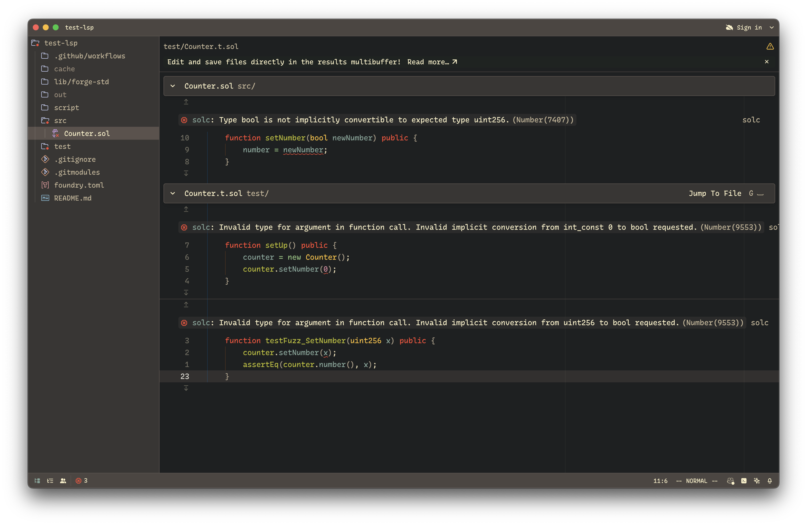

# Zolidity

Zolidity is a language extension for the [Zed](https://zed.dev) editor.
It provides syntax highlighting with [tree-sitter grammar](https://github.com/JoranHonig/tree-sitter-solidity)
written by [@JoranHonig](https://github.com/JoranHonig). (ty!!)
The [`highlights.scm`](./languages/solidity/highlights.scm) tree sitter queries are
copied from the [`nvim-treesitter`](https://github.com/nvim-treesitter/nvim-treesitter) repo.

It also provides limited lsp features using [`solidity-analyzer`](https://github.com/parmanuxyz/solidity-analyzer).
Note: It is assumed that you already have `solidity-analyzer` installed
and reachable via your `$PATH`. I might add auto download and install
functionality in the future.
Features available:

1. Code format
2. Diagnostics

Development of solidity-analyzer has more or less been stagnant since just
the diagnostics is enough useful over existing alternative LSP options.
But maybe I will pick it up again sometime and add more features.

We could also add and configure other existing LSPs and let the user choose
which one to use. I thing the most prominent to integrate would be the
Hardhat LSP server.

## Screenshot

## Usage

1. Clone this repo: `git clone git@github.com:parmanuxyz/zolidity.git`
2. Install the extension in dev mode in Zed:
   1. Open command palette
   2. Search for `zed: install dev extension` action and run it
   3. In the path picker, select the `zolidity` repo path
